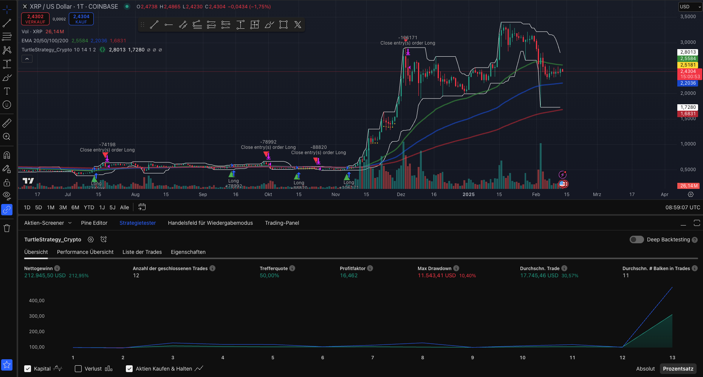
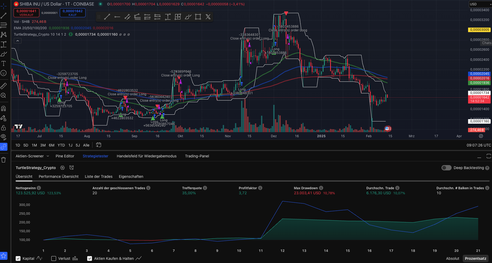

# Turtle Trading Strategy

This project implements the Turtle Trading strategy using Backtrader and Streamlit. The strategy is a trend-following system that uses breakout levels and the Average True Range (ATR) for position sizing and trade decisions.

The rules and parameters in this implementation are based on the original Turtle Trading rules, as documented in [this PDF](https://bigpicture.typepad.com/comments/files/turtlerules.pdf) by OriginalTurtles.org.

**Note**:
- Currently, only the long strategy is implemented. The short logic, which is part of the traditional Richard Dennis strategy, has been disabled for now.
- Commission fees are also not included in the trade and return calculations but will be enabled soon.
- Taxes, which vary by region, are also not part of the calculations and may further impact returns

## Features

- **Backtesting**: Simulate the Turtle Trading Strategy over different asset classes
- **Streamlit Interface**: A user-friendly web interface to input parameters and view results.
- **Trade Analysis**: Analyze trades to determine best and worst trades, calculate performance metrics, and visualize results.

## Installation

1. **Clone the repository**:
   ```bash
   git clone https://github.com/yourusername/turtle-trading-strategy.git
   cd turtle-trading-strategy
   ```

2. **Create a virtual environment**:
   ```bash
   python -m venv env
   source env/bin/activate  # On Windows use `env\Scripts\activate`
   ```

3. **Install the required packages**:
   ```bash
   pip install -r requirements.txt
   ```

## Usage

1. **Run the Streamlit app**:
   ```bash
   streamlit run streamlit_app.py
   ```

2. **Navigate through the app**:
   - Choose stock or crypto ticker, set basic settings and trading parameters and run the backtest 

## Strategy Parameters

- **Breakout Period High**: Number of days for breakout high calculation
- **Breakout Period Low**: Number of days for breakout low calculation
- **ATR Period**: Average True Range calculation period
- **ATR Multiplier**: Multiplier for ATR-based stops
- **Risk Percentage**: Risk per trade as a decimal (e.g., 0.02 for 2%)

# Turtle Trading Strategy

This project implements the Turtle Trading Strategy using Backtrader and Streamlit. The strategy is a trend-following system that uses breakout levels and the Average True Range (ATR) for position sizing and trade decisions.

**Note**: Currently, only the long strategy is implemented. The short logic, which is part of the traditional Richard Dennis strategy, has been disabled for now.

The rules and parameters used in this implementation are originally based on the Turtle Trading rules as documented in [this PDF](https://bigpicture.typepad.com/comments/files/turtlerules.pdf).

## Features

- **Backtesting**: Utilize Backtrader to simulate the Turtle Trading Strategy over historical data.
- **Streamlit Interface**: A user-friendly web interface to input parameters and view results.
- **Trade Analysis**: Analyze trades to determine best and worst trades, calculate performance metrics, and visualize results.
- **Multi-Page Navigation**: Navigate between different sections of the app, including Home, Parameter Optimization, FAQ, and About.

## TradingView Implementation

In addition to the Python/Streamlit implementation, I have converted the code into a [PineScript](turtle_strategy_pinescript.txt), which is TradingView's programming language, enabling seamless testing, parameter refining and analysis within TradingView.

Some key benefits include:

- **Real-Time Data Visualization**:  Automatically display buy and sell signals generated by the PineScript directly on the chart for any selected ticker
- **Customizable Parameters**: Easily adjust strategy settings and assess trading with logs and performance metrics
- **Set Alerts**: Set your own alerts for each ticker and get notifications via email and on any device

Below are a few example charts showcasing the strategy in action on TradingView:




## Contributing

Contributions are welcome! Please fork the repository and submit a pull request for any improvements or bug fixes.

## License

This project is licensed under the MIT License. See the [LICENSE](LICENSE) file for details.

## Contact

For questions or feedback, please contact me on [LinkedIn](https://www.linkedin.com/in/oktay-bogazkaya/).
